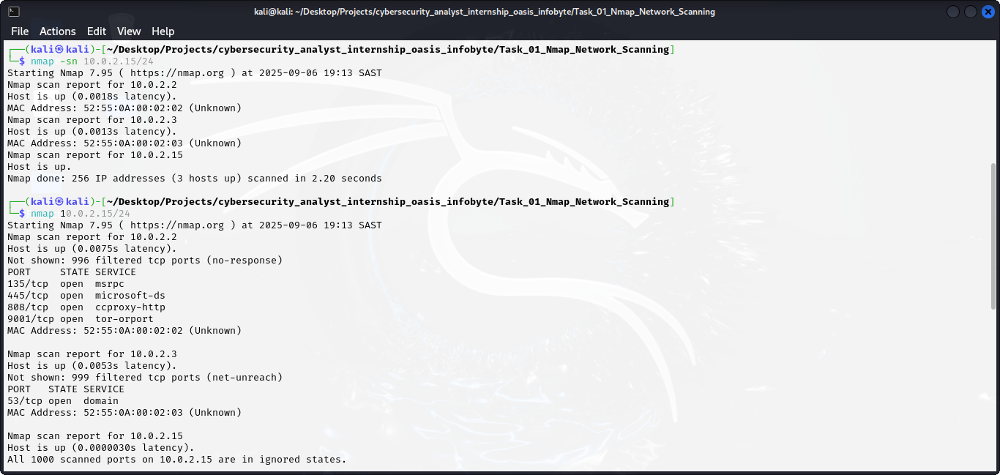

# Cybersecurity Analyst Internship Project - Oasis Infobyte

This project consists of different tasks of my **Cybersecurity Analyst Internship**. It includes 10 tasks covering topics such as network scanning, firewall configuration, vulnerability assessment, and reporting. The goal of this project is to apply cybersecurity fundamentals in real-world scenarios and document findings.  

## Tasks
1. Network scanning with Nmap  
2. Basic Firewall Configuration with UFW  
3. SQL Injection on DVWA (Low Security)  
4. Research Report on Common Network Security Threats  
5. Research Report on Social Engineering Attacks  
6. Research Report on the Importance of Patch Management  
7. Vulnerability Scanning with Nikto  
8. Capture Network Traffic with Wireshark  
9. Exploit a Vulnerability in a Web Application (SQLi)  
10. Write a Detailed Security Assessment Report for a Network  

## Technologies Used
- Kali Linux  
- Nmap  
- UFW (Uncomplicated Firewall)  
- DVWA (Damn Vulnerable Web Application)  
- Nikto  
- Wireshark  
- SQL Injection techniques  
- Markdown for documentation  

## How to Run
- Clone this repository:  
  ```bash
  git clone https://github.com/username/cybersecurity_analyst_internship_oasis_infobyte.git


---

### 7. **Reports**
Link to your reports per task:  
```markdown
## Reports
- [Task 1: Nmap Network Scanning](Task_01_Nmap_Network_Scanning/report.md)  
- [Task 2: Firewall Configuration](Task_02_Firewall_Configuration/report.md)  

## Screenshots


## Conclusion
This internship project gave me hands-on experience with cybersecurity tools, vulnerability scanning, and report writing.  
It helped strengthen my knowledge of network security and practical penetration testing workflows.  
