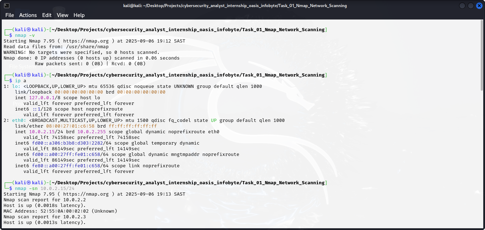
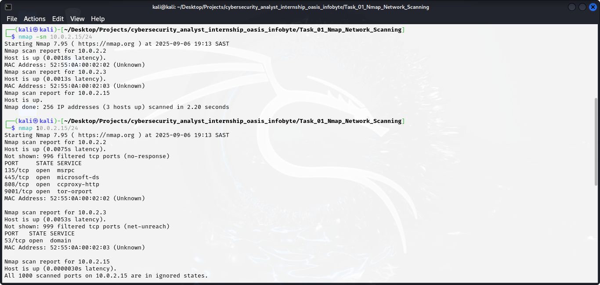
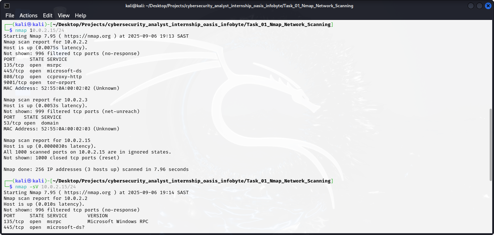
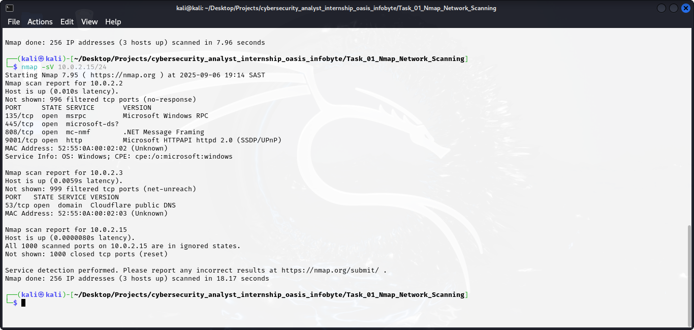

# Task 1: Basic Network Scanning with Nmap

## Introduction
This report documents the findings collected from scanning a Network on a local Virtual Machine and connected hosts using Nmap as part of Task 1.

## Network Scanning tool
- Nmap Version: 7.95

## Commands Used
-  ip a : Get your ip address
-  nmap -sn (ip address): use Ping scan to check if the machin is online
-  nmap (ip address): identifies open ports and services 
-  nmap -sV (ip address): It runs a service version detection scan

## Targets

- Local VM IP: 10.02.15
- 10.0.2.2 and 10.0.2.3 are also connected hosts that were discovered in the network scan.

## Nmap Scan Results
### Open ports and services found

| IP Address   | Port | Service        | State | Significance |
|-------------|------|----------------|-------|-------------|
| 10.0.2.2    | 135  | msrpc          | open  | Windows RPC port; used for remote procedure calls. |
| 10.0.2.2    | 445  | microsoft-ds   | open  | File sharing service; could be vulnerable. |
| 10.0.2.2    | 808  | mc-nmf         | open  | Proxy/web service; open port could allow unauthorized access. |
| 10.0.2.2    | 9001 | http           | open  | Microsoft HTTPAPI; could be exploited if exposed. |
| 10.0.2.3    | 53   | domain         | open  | DNS service; critical for name resolution. |
| 10.0.2.15   | —    | —              | closed| No open ports detected; safe configuration. |

## Screenshots

## Analysis and Significance
- The hosts with open ports such as "10.0.2.2" and "10.0.2.3" need to be monitored and secured to prevent unauthorized access.
- Each Open port aligns to a service that has a possibility of being exploited if it is not updated or configured correctly.
- The local Virtual Mechine of "10.0.2.15" shows all the ports are closed, which shows it is a good security posture for a test machine.

## Conclusion
